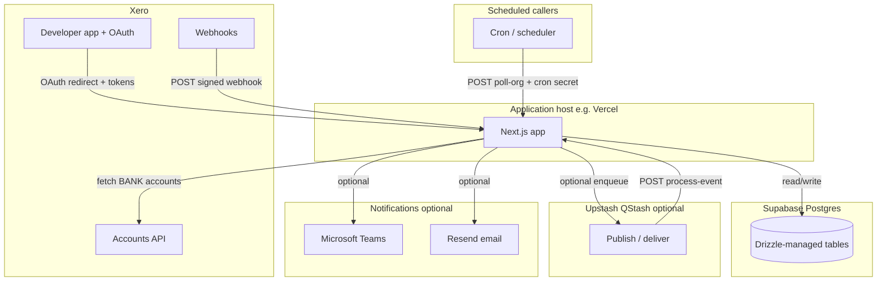
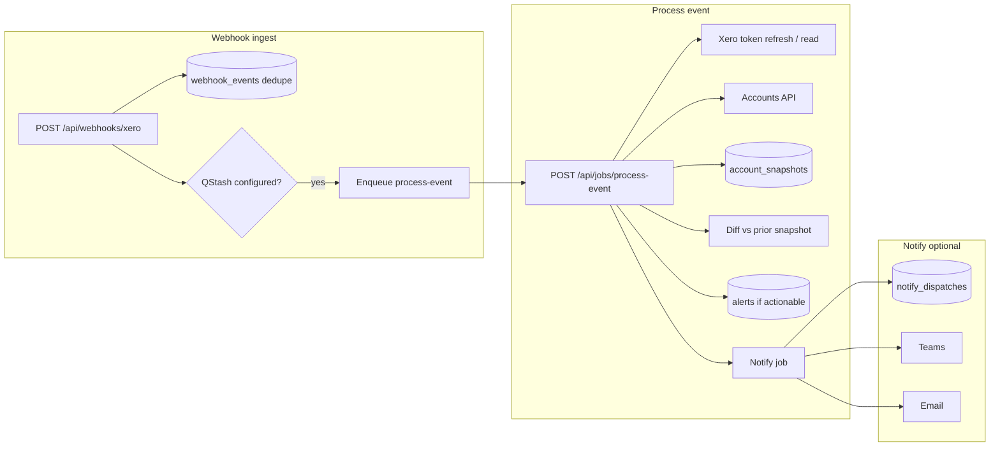
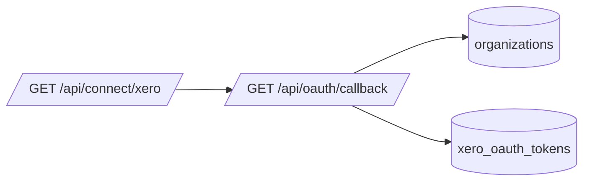
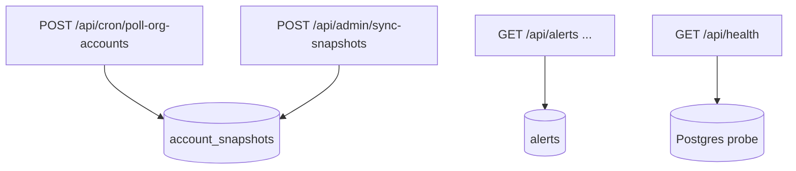

# Data and platform workflow

High-level view of **platforms**, **persistence**, and **request flows**. Table shapes and migrations are defined in code (`lib/db/schema.ts`, `drizzle/`); this page is an orientation map only.

## Platforms and stores

## Persistence overview

| Table | Role in the pipeline |
| ----- | -------------------- |
| `organizations` | Tenant identity keyed by Xero tenant id. |
| `xero_oauth_tokens` | Encrypted OAuth tokens per organization. |
| `webhook_events` | Idempotent intake of Xero webhook payloads. |
| `account_snapshots` | Latest BANK snapshot payload per organization. |
| `alerts` | Operator-visible alerts (e.g. from actionable diffs). |
| `notify_dispatches` | Durable dedupe for outbound notifications. |

RLS is enabled on tables; the app connects with credentials that match your migration policies (see `drizzle/` service-role policies).

## Main runtime flows

### Webhook intake and processing

### OAuth connect (tenant linkage)

### Supporting operator and cron paths

## Related

- Operator procedures: [`docs/runbooks/go-live.md`](../runbooks/go-live.md), [`docs/runbooks/webhook-pipeline.md`](../runbooks/webhook-pipeline.md)
- Trust model: [`trust-and-secrets.md`](./trust-and-secrets.md)
